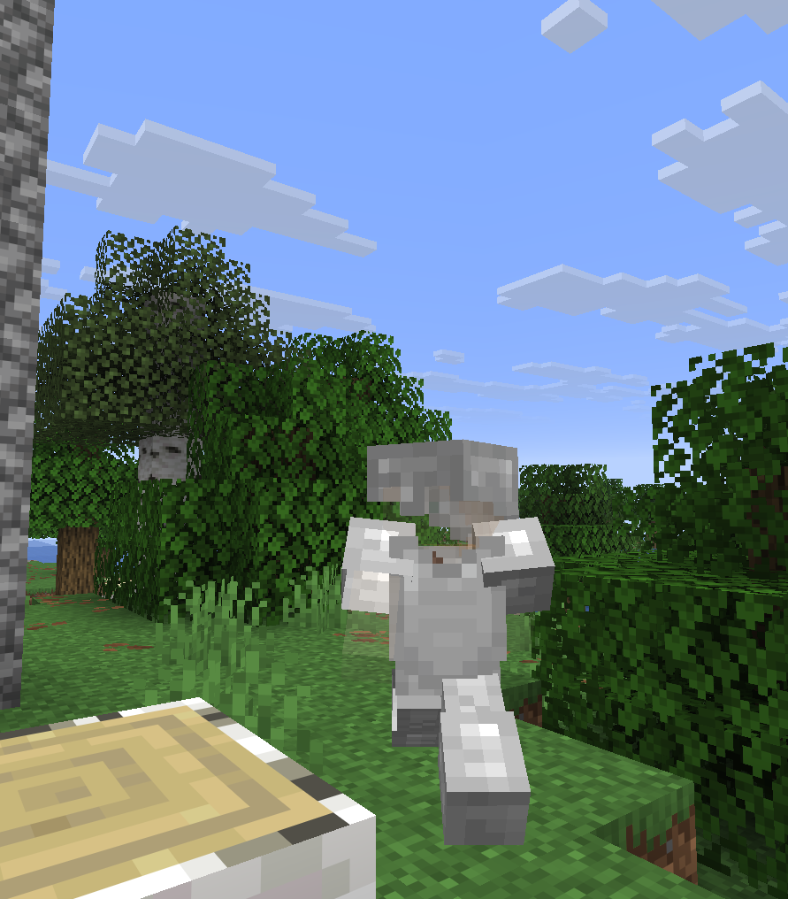
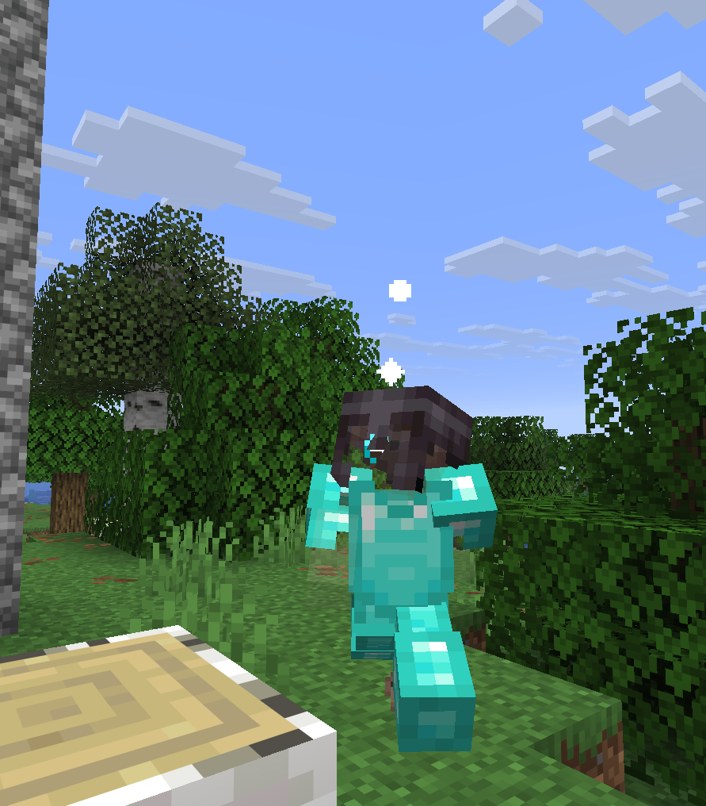
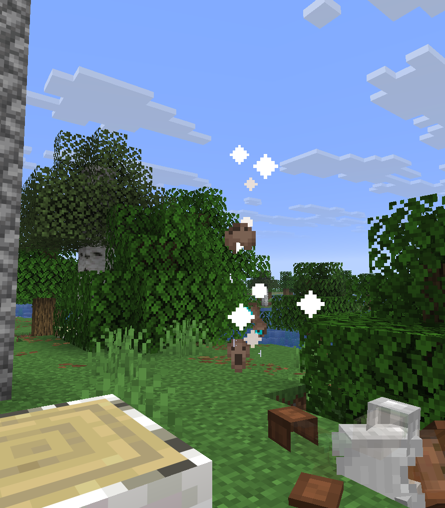
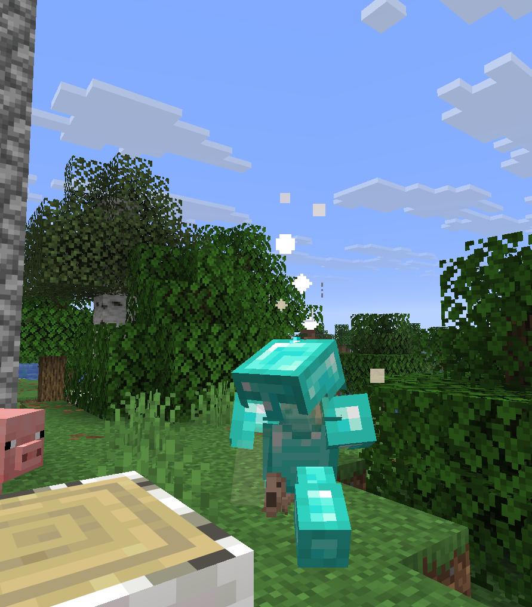

# Echoes — A Fabric Mod for World Memory

[](https://fabricmc.net/)
[](https://fabricmc.net/)
[](https://www.oracle.com/java/)
[](LICENSE)

**Minecraft worlds have no memory.** You can spend hundreds of hours building, exploring, and dying in a world — but once a player logs off or moves on, the world retains zero evidence of what happened.

**Echoes makes the world remember.**

Significant moments — deaths, boss kills, structure discoveries, milestones, and marathon journeys — leave behind ghostly, ethereal imprints at the coordinates where they occurred. When another player (or you, returning later) encounters one of these locations, a translucent ghost replay of the original player acts out that moment, accompanied by ambient audio and particle effects.

No intrusive UI. No minimap markers. No immersion-breaking popups. Just an ambient world that feels lived in.

| Journey Replay (Whisper) | World First Triumph (Radiant) |
| :---: | :---: |
|  |  |
| **Tragic Death Collapse (Mark)** | **Memory Inspection (Crouch / Scar)** |
|  |  |

---

## Table of Contents
1. [Features & Echo Taxonomy](#features--echo-taxonomy)
2. [The Echo Crystal](#the-echo-crystal)
3. [Ghost Visuals & Audio](#ghost-visuals--audio)
4. [Commands Reference](#commands-reference)
5. [Configuration (`config/echoes.toml`)](#configuration)
6. [Performance & SMP Safeguards](#performance--smp-safeguards)
7. [Installation & Requirements](#installation--requirements)
8. [Building from Source](#building-from-source)

---

## Features & Echo Taxonomy

Echoes are organized into **four emotional tiers**. Tier determines the visual intensity, particle density, sound resonance, and decay lifetime of the ghost.

```
┌────────────────────────────────────────────────────────────────────────┐
│                               TIERS                                    │
│                                                                        │
│  [1] WHISPER      Faint, ambient, brief (7-day default decay)         │
│  [2] MARK         Visible, ethereal blue, detailed (30-day decay)     │
│  [3] SCAR         Intense, particle-dense, dramatic (60-day decay)    │
│  [4] WORLD FIRST  Prestigious, golden aura (Permanent / Never decays)  │
└────────────────────────────────────────────────────────────────────────┘
```

### Complete Event Triggers

| Event Type | Tier | Trigger Condition | Playback Duration |
|---|---|---|---|
| **Death** | Mark (Tier 2) | Normal player death | 5 seconds (death tilt + collapse) |
| **Catastrophic Death** | Scar (Tier 3) | Death with 30+ XP levels or full enchanted armor | 8 seconds |
| **First Biome Visit** | Whisper (Tier 1) | First time a player enters a new biome in the world | 3 seconds |
| **Structure Discovery** | Mark (Tier 2) | Entering a major structure (Stronghold, Mansion, Ancient City, etc.) | 5 seconds (deduplicated per 256m) |
| **Dimension Entry** | Mark (Tier 2) | First time entering the Nether or the End | 5 seconds |
| **Boss Defeat** | Scar (Tier 3) | Slaying the Ender Dragon, Wither, or Elder Guardian | 8 seconds |
| **Major Craft** | Mark (Tier 2) | First craft of Diamond tool, Netherite, Enchanting Table, Beacon, or Elytra | 5 seconds |
| **Pet Taming** | Mark (Tier 2) | Taming a pet (wolf, cat, parrot, etc.) | 4 seconds |
| **First Sleep** | Whisper (Tier 1) | First successful night slept in a bed | 3 seconds |
| **First Trade** | Whisper (Tier 1) | First successful trade with a villager | 3 seconds |
| **First Elytra Flight** | Scar (Tier 3) | First time soaring with an Elytra | 8 seconds |
| **Long Journey** | Whisper (Tier 1) | Traveling 500+ blocks in one session without teleporting | 3 seconds |
| **Marathon Journey** | Scar (Tier 3) | Traveling 2,000+ blocks in one session without teleporting | 6 seconds |
| **Manual Crystal Mark** | Scar (Tier 3) | Sneak + Right-Clicking with an Echo Crystal | 8 seconds |
| **World First** | World First | Server-first boss kill, End entry, or Elytra flight | 10 seconds (Golden tint) |

---

## The Echo Crystal

The **Echo Crystal** is a survival-friendly item crafted from Ghast Tears and Amethyst Shards.

```
Crafting Recipe:
  [ Amethyst ] [ Amethyst ] [ Amethyst ]
  [ Amethyst ] [ Ghast Tear] [ Amethyst ]
  [ Amethyst ] [ Amethyst ] [ Amethyst ]
```

### Item Uses:
- **Right-Click (Sense Nearby)**: Emits a resonant chime and bursts particles in the direction of nearby echoes within a 32-block radius.
- **Right-Click on Ghost (Inspect)**: Looking at an active ghost within 10 blocks displays the echo's metadata (original player's name, relative timestamp, and event category).
- **Sneak + Right-Click (Leave Mark)**: Consumes 1 durability to record an intentional 8-second memory of yourself at that exact location.

---

## Ghost Visuals & Audio

- **Accurate Player Poses**: Fully animates walking, running, crouching/sneaking, elytra flight (horizontal pitch), swimming, and natural death tilt (`Axis.ZP` fall progression).
- **Player Skin & Dual Layers**: Renders the player's authentic skin along with secondary skin layers (hats, jackets, sleeves, pants, and capes).
- **Equipment & Armor**: Reconstructs helmets, chestplates, leggings, boots, and held items from recorded equipment snapshots.
- **Tier-Specific Aesthetics**:
  - *Whispers & Marks*: Pale blue translucent glow with subtle soul particles and amethyst chimes.
  - *Scars*: Dense particle trails, challenge completion audio cues, and increased brightness.
  - *World Firsts*: Radiant ethereal gold coloring (`#FFE696`), flash bursts on spawn, and lingering particle halos.
- **No Floating Nametags or Shadows**: Ghosts cast zero ground shadows and omit immersion-breaking overhead nametags.

---

## Commands Reference

Requires Operator / GameMaster permission level for administrative commands:

| Command | Permission | Description |
|---|---|---|
| `/echoes optout <visibility\|display\|all>` | All Players | Configure personal privacy (opt out of leaving echoes, seeing echoes, or both). |
| `/echoes worldfirsts` | All Players | Displays all claimed server-wide World First achievements. |
| `/echoes clear [radius]` | Admin | Clears echoes within a radius around the command sender. |
| `/echoes clear <player> [radius]` | Admin | Clears echoes within a radius around a target player. |
| `/echoes debug` | Admin | Toggles live verbose debug logging for echo capture and playback. |

---

## Configuration

Echoes creates an extensive, self-documenting TOML configuration file at `config/echoes.toml`:

```toml
[general]
enabled = true              # Enable/disable the mod
self-echoes-visible = true  # Whether players can trigger their own echoes
allow-player-optout = true  # Allow players to use /echoes optout

[triggers]
death = true
boss-kill = true
structure-discovery = true
dimension-enter = true
major-craft = true
biome-discovery = true
taming = true
world-first = true
manual-crystal = true
journey-tier1-distance = 500
journey-tier2-distance = 2000

[decay]
enabled = true
whisper-days = 7
mark-days = 30
scar-days = 60
world-first-days = -1       # -1 = Permanent

[limits]
max-echoes-per-chunk = 8    # Auto-evicts oldest whispers when chunk limit is exceeded
max-echoes-per-player = 50
max-echoes-global = 2000

[playback]
trigger-radius = 16         # Proximity distance in blocks
max-concurrent = 1          # Prevents sensory overload in echo-dense areas
repeat-death-echoes = false # Set true for death echoes to replay repeatedly
whisper-opacity = 0.25
mark-opacity = 0.45
scar-opacity = 0.70

[performance]
scan-interval-ticks = 10    # Proximity scan frequency (0.5s)
async-recording = true      # Offloads rolling frame capture to background threads

[privacy]
hide-player-names = false   # Anonymizes chat/tooltip inspection
anonymize-all = false       # Strips all player skins, using default skins
```

---

## Performance & SMP Safeguards

Echoes is engineered from the ground up for high-population SMP stability:

1. **Network Downsampling**: Frame payloads are automatically downsampled on the server by 75%, saving bandwidth.
2. **Client-Side Catmull-Rom Interpolation**: The client controller reconstructs smooth 60fps+ trajectories using Catmull-Rom spline curves for positions and spherical linear interpolation (Slerp) for angles.
3. **Chunk-Spatial Indexing**: World state queries use chunk coordinates (`chunkX`, `chunkZ`) for $O(1)$ spatial lookups instead of scanning global lists.
4. **Distance-Based Culling**: Full model rendering is culled beyond 64 blocks; particle emissions drop to 25% beyond 16 blocks and 0% beyond 32 blocks.
5. **Safe Ground Detection**: Falling into the void or lava does not trap ghosts in mid-air or under lava; death echoes anchor to the last solid, non-hazardous block stood upon.
6. **Graceful Pipeline Fallback**: Automatically falls back to vanilla translucent entity rendering if custom shaders encounter hardware or driver anomalies.

---

## Installation & Requirements

- **Minecraft**: `26.1.1`
- **Fabric Loader**: `>= 0.18.6`
- **Fabric API**: `>= 0.145.3+26.1.1`
- **Java**: Java 25 or newer

Drop the compiled mod `.jar` into the `mods/` directory of your client and/or dedicated server.

---

## Building from Source

```bash
git clone https://github.com/vardanrattan/echoes.git
cd echoes
./gradlew build
```

The compiled mod artifacts will be generated in `build/libs/`.

---

## License

Echoes is licensed under the [Creative Commons Zero v1.0 Universal](LICENSE) (CC0-1.0) Public Domain Dedication.
